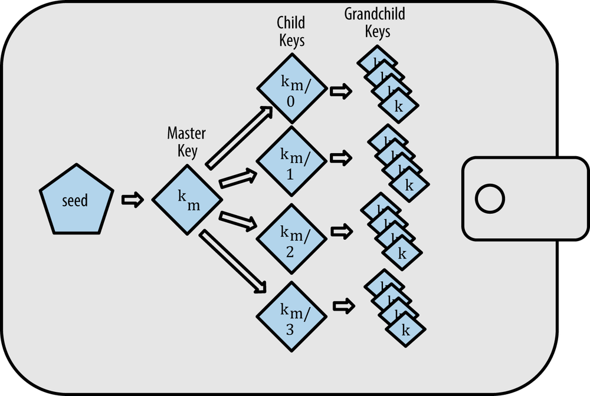

# blockchain-learnings

## Origin
Stuart Haber & W. Scott Stornetta - paper on how to timestamp a digital document

## What is blockchain ?
A blockchain is a growing list of records (called blocks) that are linked together with cryptography.
Each block contains a cryptographyic hash of the previous block, a timestamp and the current blocks data.

- As each block contains the information about the block previous to it, they form a chain, with each additional block reinforcing the ones before it. Therefore blockchains are resistant to modification, because once recorded, the data in any given block cannot be altered retroactively without altering all subsequent blocks.

## Block
- Data
- Perviuos hash
- current hash
- timestamp

### Genesis Block
The first block of a blockchain. It does not have a previous hash.

## Hashing
Hashing is a function to map data of arbitarary size to a fixed size.
Hashing function requirements :
- One way
- deterministic : for a given input value it must always generate the same hash value.
- Fast Computation
- The avalanche effect (must in cryptography)
- Must withstand collisions

### SHA256 cryptography (Hashing algorithm)
- Scecure Hash Algorithm + 256 bits memory it takes
- it is a hexadecimal hash (possible characters are 0-9 and A-F)
- The SHA hash is always 64 characters long (64 * 4 bits for each char = 256 bits )
- The alogorithm works for any type of data like text, imagesm video etc.

## Immutable Ledger
- A ledger is typically a book or collection of accounts in which account transactions are recorded.
- The word Immutable means “cannot be changed.” 

## Distributed P2P (Peer to Peer) network
- P2P is a decentralized network communications model.
- It consist of a group of devices (nodes) that collectively store and share files where each node acts as an individual peer.
- P2P communication is done without any central administration or server. All nodes have equal power and perform same tasks.
- P2P architecture of blockchain removes the need of any middle-man or central server.
- With the P2P network anyone who wishes to participate in the process of verifying and validating blocks can setup a node.

P2P pros :
- As P2P is decentralized, it is highly available due to decentralization.
- P2P networks offer greater security compared to traditional client-server systems

## Byzantine fault tolerance
A fundamental problem in distributed computing and P2P systems is to achieve overall system relaibility in presence of number of faulty processes.  
This often requires processes to agree on some data value that is needed for computing.  
This is called consensus.

- Byzantine Fault Tolerance is the characteristic which defines a system that tolerates the class of failures that belong to the Byzantine Generals’ Problem.

## Consensus Protocol
There are several protocols to achieve consensus in P2P network.
- Proof-of-Work (PoW)\
Proof of Work provides a powerful stamp that says ‘this history cannot be changed without doing a lot of work.
- Proof-of-Stake (PoS)

## Nonce
- Nonce (Number only used once) is a number added to a hashed - or encrypted block in blockchain that, when rehashed, meets the dificulty level restrictions. The nonce is the number the blockchain miners are solving for, in order to receive cryptocurrency.
- Nonce is usually a 32bit number which can go from 0 to 2^32

---------------------------------------------
# BITCOIN - a blockchain technology implementation
- Bitcoin is a decentralized digital currency based on **blockchain technology**, without a central bank or single administrator, that can be sent from user to user on the peer-to-peer bitcoin network without the need for intermediaries.
- The Bitcoin crypto-currency was invented in 2008 by an unknown person or group of people using the name Satoshi Nakamoto.
- The Bitcoin currency came to use in 2009.

## Bitcoin Protocol
There is a defined protocol for bitcoin to work as a crypto-currency based on blockchain technology. The bitcoin protocol states following points

### Decentralized Network
Bitcoin uses distributed ledger technology. Decentralized P2P network of nodes help to verify transactions in bitcoin.

### Proof of work consensus
Bitcoin uses proof of work consensus mechanism to rresolve conflicts in the distributed blockchain ledger. The node or group of nodes which wants to add a block (containing transactions) to the distributed blockchain ledger of bitcoin, need to solve a mathematical eqaution in oder to provide proof of work.\
This process is known as mining of blocks (in general cryptocurrency mining).

### BTC - Native currency of Bitcoin
- Each unit of currency in bitcoin blockchain is referred to as a bitcoin (BTC)
- New Bitcoins are generated when a block is added in the bitcoin distributed ledger chain.
- The bitcoin miners get the new BTC units generates as rewards for successfully adding a block in the ledger.
- The rate of BTC generated through cryptocurrency mining is programmed to cut in half every four years (known as the halving).
- Hence, The bitcoin network is designed in such a way that only 21 million BTC will ever exist with the last expected to mined(created) around year 2140.
- The above point makes BTC a deflationary asset unlike many other crypto-currencies.

### Bitcoin source code
Bitcoin Core was launched as open source software in 2009. This enables blockchain developers to continuously release new updates that improve protocol functionality.

### UTXO (Unspent Transaction Output)
- Bitcoin uses an Unspent Transaction Output (UTXO) model as a way to keep track of how funds move.
- each UTXO can only be spent once.
- When one user spends a UTXO, one or more new UTXO is created.
- In the UTXO model, one or multiple unspent outputs may be added together to reflect the total amount of funds that belong to one user.

### Bitcooin Mempool
The transactions which are sent on the Bitcoin Network are not added directly to the blockchain. All of the valid transactions have to enter a waiting area before they are accepted in a block. This waiting area is known as the mempool.

### Bitcoin Script and Opcodes
Bitcoin script is a scripting language to give Bitcoin Core instructions on how each UTXO can be spent.

### Bitcoin Private Keys
- The bitcoin protocol makes use of aysymmetric encryption.
- Users can generate private keys (secret key) and corresponding public key.
- Private Keys are meant to be kept secret, and public keys can be shared publically to receive BTC transactions.
- Only user who has access to the matching Bitcoin private key can spend funds (unlock UTXOs)
- The security of Bitcoin private keys is supported by Elliptic Curve Cryptography (ECC) and cryptographic hash functions.
- Users who want to send BTC transactions on the network can use their private key to create digital signatures. 
- A digital signature functions similarly to a one-time passcode for identity authentication. It enables the recipient of a transaction or anyone else on the network to mathematically prove with 100 percent certainty that a specific Bitcoin private key provided the signature.

### Bitcoin Address
- Bitcoin Addresses are a step further in the security of user with private and public keys.
- While users can receive funds via a **public key**, they can use a **Bitcoin wallet address** (also known as a public address) instead to receive BTC transactions.
- A public address is created from a corresponding public key using two hashing algorithms: the Secure Hash Algorithm 256 (SHA-256) and the RACE Integrity Primitives Evaluation Message Digest 160 (RIPEMD-160).
- Bitcoin wallet address (or public address) adds extra layer of security and freindlier UX by a shorter alphanumeric string.

### Bitcoin wallet
- A bitcoin wallet is not something where BTC units are stored.
- Instead, Bitcoin wallets simply act as secure key storage, and a communication tool with the blockchain (distributed ledger).

### Bitcoin HD wallets
- Although the private key is secure and not disclosed to the network, but while spending UTXO the public key has to be in open for verification of the transaction.
- Now since all transactions are on a publically distributed network and if everytime same public key is used for sending and receiving transactions, then it becomes deterministic. The balance and transaction history of a user can be determied from the blockchain for a particular public key.
- So, there is a need to limit the use of public keys to one transaction each, a new pair of private-public keys would need to be created for each transaction.\
**Deterministic Wallets** : In which all keys can be traced back to an original random seed (usually a set of random words). Means, The original seed is enough to recover all private and public keys.\
**Hierarchical Deterministic (HD) Wallets** : Advanced type of deterministic wallet. They contain keys in a tree structure, in which parent keys can produce children keys, which can produce grandchildren keys, and so on, infinitely. The cryptocurrency holder can use the tree structure to organize transactions by type of transaction or by entity involved, such as departments or subsidiaries. HD wallets also offer the option of creating public keys without having to access the corresponding private keys. This means they can be used on insecure servers or in a receive-only mode.

### Bitcoin Transactions : Pay to Pubkey (P2PK)
When a P2PK transaction is created and submitted to Bitcoin’s peer to peer network, the sender is sending funds from their own Bitcoin wallet to a public key of another user.\
If the recipient wants to spend those funds (spend the corresponding UTXO) at any point in the future, they only need to prove they own the public key to which the funds were sent.\
Its usage faded due to the added benefits provided by using public addresses instead of public keys.

### Bitcoin Transactions : Pay To Pubkey Hash (P2PKH)
P2PKH transactions are sent to the hash of the recipient's public key.\
Compared to a public key, a public key hash is a shorter and more manageable alphanumeric string.\
P2PKH enables error detection through a checksum feature, helping users to drastically reduce the odds of sending BTC to an invalid address.\

### Bitcoin Transactions : Pay To Script Hash (P2SH)
Pay To Script Hash (P2SH) was introduced as a payment type in 2012.\
P2SH transactions typically add constraints in addition to requiring an ordinary digital signature or pubkey verification. \
It is a type of ScriptPubKey which allows for the spending of bitcoin based on the satisfaction of a script (bitcoin script) whose hash is specified within the transaction.\
  For example, if Alice sends Bob 1 BTC in a P2SH transaction, she includes the hash of the script required to spend the bitcoin in the transaction. This script can require signatures by Bob’s private keys and/or many other qualifications. When Bob wants to spend the bitcoin he has received from Alice, he reconstructs the script whose hash Alice used to send the bitcoin, and signs the transaction with any private keys required by the script.
  
  ### Segregated Witness (SegWit)
  - In bitcoin blockchain, there is a size limit to each block (1 MB).
  - This is done to make the creation and synchronization of blocks easier over the P2P network.
  - Earlier a transaction information used to hold infomation like recipient public key, sender's public key, signature, transaction amount. signature being the largest information used to contribute about 60% of the transaction space. Thus, limiting the number of transactions one block can hold.
  - SegWit moves the signature outside of the transaction data. This reduces the size required for transaction storage.
  - It does this by splitting the transaction into two segments, removing the unlocking signature ("witness" data) from the original portion and appending it as a separate structure at the end. Thus, allowing more number of transactions to be fit in a block.
  

